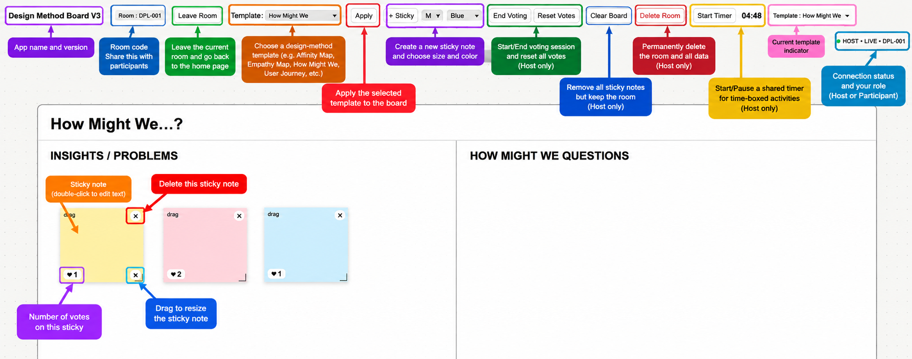

# Design Method Board

**Design Method Board** is a lightweight, browser-based collaborative whiteboard designed for teaching, workshops, and group activities in design and design research.

The tool provides a simple shared workspace where instructors and students can create, organize, discuss, and vote on ideas in real time without requiring individual user accounts.

🌐 **Live Demo:**  
https://teeravarunyou.github.io/design-method-board/

---

## Overview

Design Method Board was developed as a simplified alternative to general-purpose collaborative whiteboards for classroom use.

The main goal is to provide only the tools needed for common design-method activities while keeping the interface easy to learn and quick to use during lectures, workshops, and online classes.

An instructor creates a room and shares the **Room Code** with participants. Students can then join the same board from their own devices and collaborate in real time.

No participant registration or login is required.

---

## Features

### Real-time Collaborative Board

Multiple participants can work on the same board simultaneously.

Sticky notes are synchronized in real time, including:

- text content
- position
- size
- color
- votes

Participants can create, edit, move, resize, and delete sticky notes.

### Design Method Templates

The board includes several templates commonly used in design and research activities:

- Blank Board
- Affinity Mapping
- Empathy Map
- How Might We
- User Journey Map
- Impact–Effort Matrix

The Host can switch templates during an activity.

### Voting

The Host can start and end a voting session.

During voting, participants can vote on sticky notes to support idea prioritization and group decision-making.

The Host can also reset all votes when starting a new activity.

### Shared Timer

A synchronized timer can be controlled by the Host to support time-boxed activities such as brainstorming, discussion, and voting.

### Room-Based Collaboration

Each collaborative session uses a unique **Room Code**.

Participants only need the website URL and Room Code to join a session.

### Host Controls

Host functions are protected by a Host PIN.

Only the Host can control:

- templates
- voting sessions
- vote reset
- timer
- Clear Board
- Delete Room

### Board Management

**Clear Board** removes all sticky notes while keeping the Room Code and Host PIN active.

**Delete Room** permanently removes the room and its associated board data when the session is no longer needed.

---

## Screenshots

## Interface Overview

The main interface provides real-time collaboration tools for design-method activities.

---

## How to Use

### For Instructors

1. Open the Design Method Board.
2. Select **Create Room**.
3. Create or generate a Room Code.
4. Set a Host PIN.
5. Share the website URL and Room Code with participants.
6. Join the room as Host.
7. Select a template and begin the activity.

Keep the Host PIN private.

### For Participants

1. Open the Design Method Board.
2. Select **Join as Participant**.
3. Enter the Room Code provided by the instructor.
4. Start collaborating on the shared board.

No account or registration is required.

---

## Example Teaching Workflow

A typical classroom activity might follow this sequence:

**Individual brainstorming → Affinity Mapping → Group discussion → Voting → Prioritization**

For example, students can first create individual sticky notes, organize related ideas using Affinity Mapping, discuss emerging themes, and then use the voting function to identify ideas for further development.

---

## Technology

Design Method Board uses a lightweight web architecture:

- **HTML, CSS, and JavaScript** for the user interface
- **GitHub Pages** for web hosting
- **Supabase PostgreSQL** for board data
- **Supabase Realtime** for live synchronization

The application does not require a dedicated application server.

---

## Data and Privacy

The board is designed for classroom and workshop activities rather than the storage of sensitive information.

Board content is stored in the project's Supabase database and associated with a Room Code.

Host PINs are not stored as plain text. PIN verification is handled through server-side database functions, and PIN hashes are stored separately from public board state.

Users should avoid entering confidential, personally identifiable, or sensitive information on shared boards.

---

## Current Scope

Design Method Board is intended as a lightweight educational collaboration tool.

It currently focuses on:

- sticky-note collaboration
- structured design-method templates
- voting
- time-boxed activities
- simple room-based access

It is not intended to replace full-featured platforms such as Miro or FigJam.

---

## Future Development

Possible future improvements include:

- image and screenshot upload
- additional design-method templates
- export board as image or PDF
- board history and activity summaries
- facilitator tools
- improved mobile and tablet interaction
- anonymous participant names or cursors

---

## Educational Use

This project was developed primarily to support active and collaborative learning in design-related courses and workshops.

Educators are welcome to adapt the tool to different teaching activities and design-method exercises.

---

## Project Status

**Version 3 — Working Prototype**

The current version supports real-time multi-user collaboration and has been tested across multiple devices.

Further development will focus on usability, teaching workflows, and additional design-method activities.

---

## License

A license has not yet been specified.

If this repository is intended for public reuse or modification, an open-source license such as the MIT License can be added.

---

## Author

Developed by **Teeravarunyou** as an educational tool for collaborative design-method learning and workshop activities.
